# SillyCord
## A discord-like app based on flask

This is a simple messaging app, with basic features like: auth (username, password, email), email confirmation, profiles, profile editing, realtime messaging. This app was made to train my self and prove what I can make. That means that this code is **not safe** and **not ready for production**, please for your own safety do not use this code in a production environment. Also none of this code was made by an AI, I'm prooving my skills as a backend dev, not as a prompt engineer.
Have fun!

## Run the project

You'll need python 3.11 or higher and git installed on your PC.\
If you want you can create a python virtual environment.
1. First clone the GitHub repository with this command.\
``git clone https://github.com/ArnoStar/SillyCord.git`` \
After that enter the SillyCord dir\
``cd SillyCord``
2. After that you'll need all the requirements, install them with this command\
``pip install -r requirements.txt``
3. Before running the project you need to set up some environment variables,
if you don't know how just create a .env file and set variables like this:
````
DEBUG=0 #Set to 0 if you want the debug set to false, 1 if true
SECRET_KEY=writeARandomSecretString
DATABASE_URL=sqlite:///SillyCord.db #Unless you know what you're doing you should this like it is

MAIL_SERVER=smtp.gmail.com #I recomand you to use the stmp gmail server
MAIL_USERNAME=yourMail@gmail.com
MAIL_PASSWORD=**** **** **** **** #This password is NOT the password of your gmail account you'll need to find the password for app
MAIL_DEFAULT_SENDER=yourMail@gmail.com #This should be the same email as upward
````
4. Now the setup is finished, you just need to run the project with this command:\
``py run.py``

## Project structure

This is the basic information that you'll need to understand what is going on in this strange code. Don't worry everything will be fine :-) 

### SQL DB


This is the DB structure that is used in this code:
- TemporaryUser is the table that stores information about the user before he confirm his email.
- User stores all the information about the user. I know, that was really unpredictable.
- Chat stores just the links to all messages in the chat, and UserChatLinks.
- UserChatLink was made to make a many to many relationship between Users and Chats, but it also stores things that are related only to one User and one Chat.
- Message stores the message (NO WAY), when it was made, by who and to what chat.

### Logic
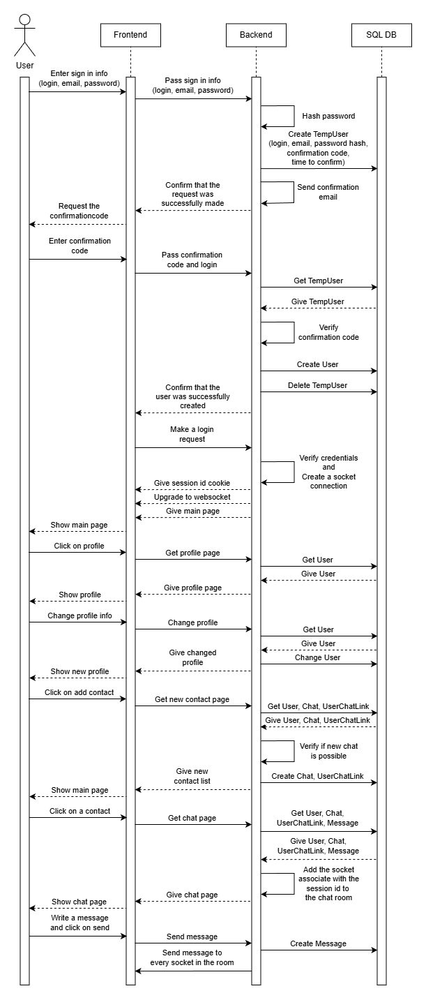

This a diagram that explain the basic logic.

## How to use
Soooooooo, you've installed whatever **this** is (a really cool project for a junior backend dev (please I really need this job)). And now you're asking your self how to use this masterpeace of software engineering. Don't worry this is really easy, watch.
After running the command ``py run.py`` and tape in your browser http://127.0.0.1:5000, you should see:

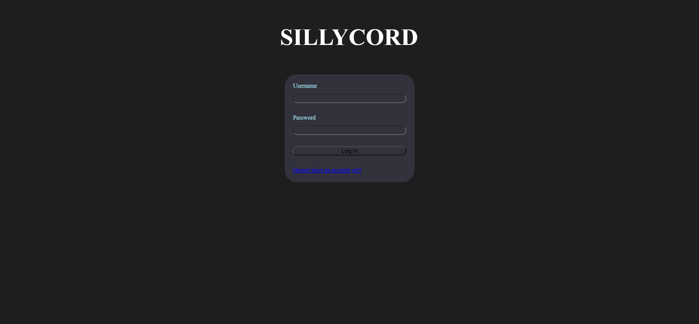

WOW! What is this? Is this a paiting made by Leonardo da Vinci? Oh no, my bad, this is just my UI.
This is the login screen, but we have ONE and only ONE probleme. We don;t have an account, that's sad but my really big brain have a solution for you! You see at the bottom of your screen there is an unreadable "Doesn't have an account yet?". If you click on it you will see

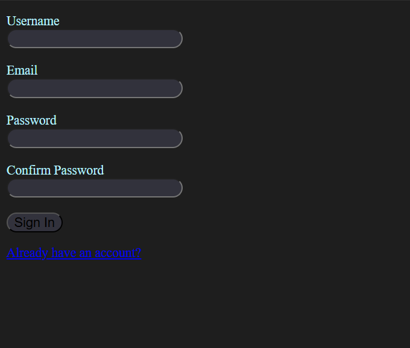

the sign in page. This is why I don't do front end. Now you just need to put your username, your email (a real one), and your password two times. Pretty easy. After clicking on signin you should receive a code to your email.

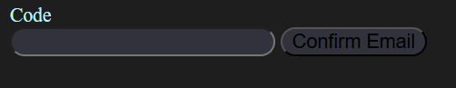
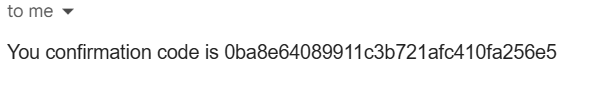

After you confirmed you should be automatically loged in.

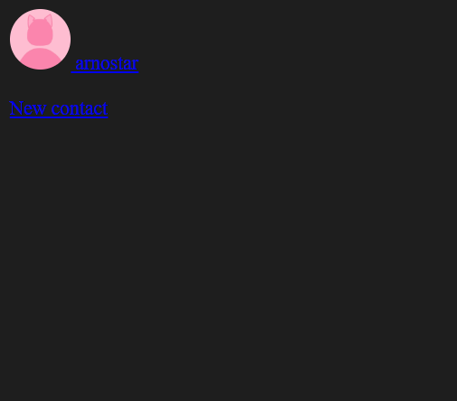

Here is the main page. For now it is a bit empty. That's cause you have no friend! Don't worry that's maybe sad but totally normal! But before we find you a friend let's edit your profile. Click on your self.

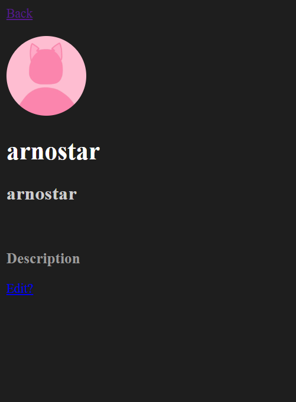

Hmmmmm, your nickname and your description are really boring. Let's try to edit that. Click on the still unreadable Edit? button.


Change whatever you want, and click on submit on everything that you want to change.

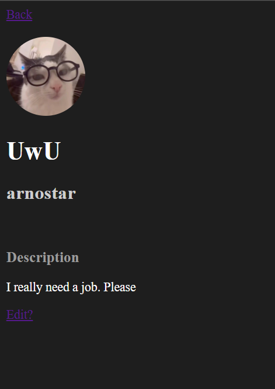

As you can see my profile is really cool. But enough talking about me, let's talk to my friend! You want to know his name? Of course you want to know his name! His name is Loris, he's my best friend! And I've created an acount for him, because that what does a real friend. Now let's add him.

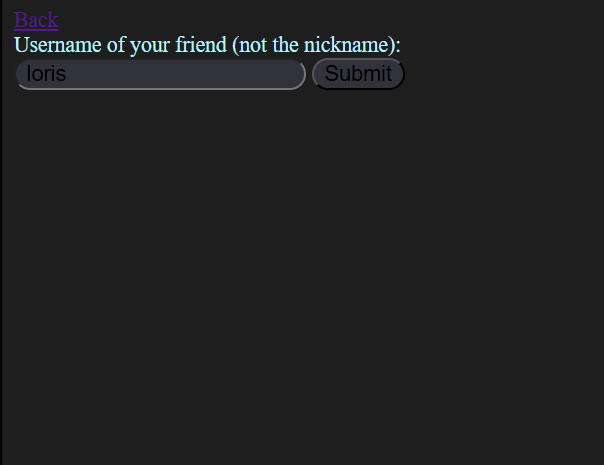

Now let's go to the before empty main page.

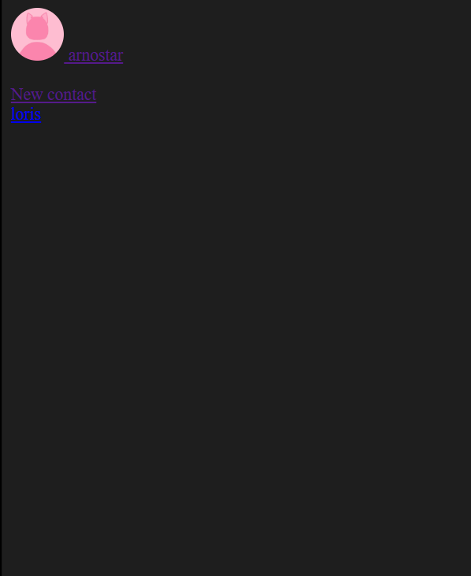

WOW! Now it's a lot less empty, you see there one more line. I think this is to much information but faire enough. This is what sees Loris on his screen (if he realoads his page):

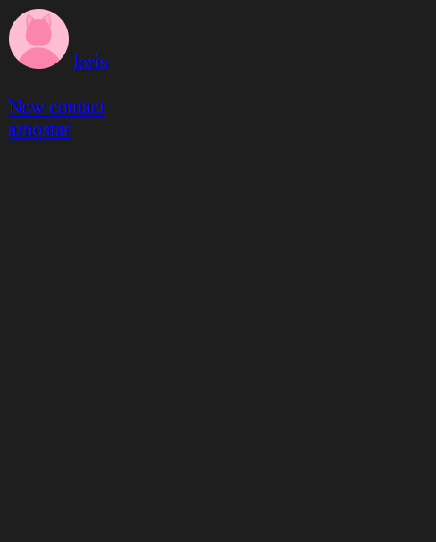

I didn't talk to Loris for a long time, let's click on him.

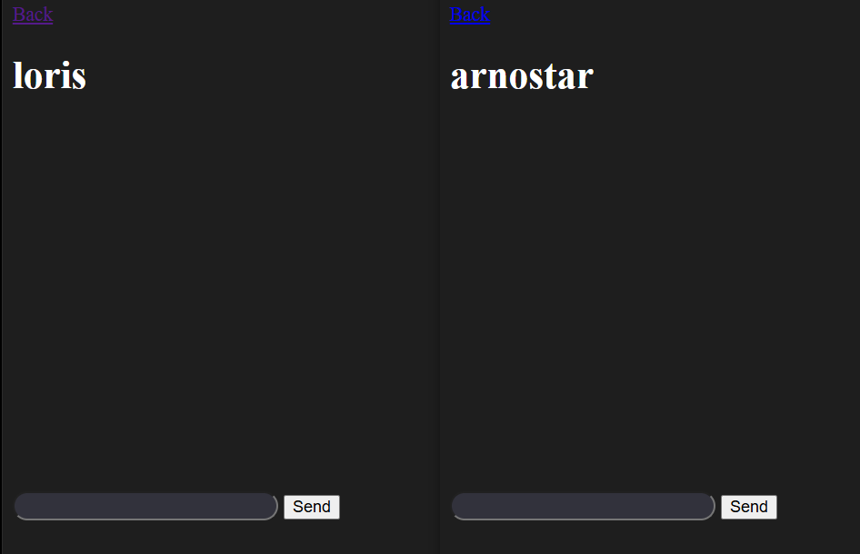

No way, I can talk with him? For real? Let's try this.

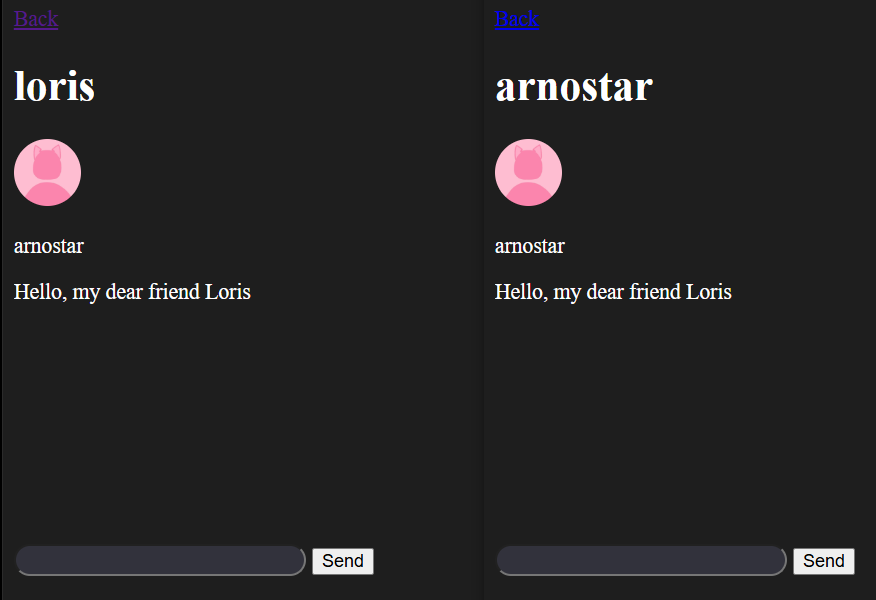

WOW AND THIS IS REAL TIME (imagine that you can see that on a image).
Well that was a great adventure and a great app. The only thing that I can add is good luck with whatever you are trying to do with this and thanks for reading all of this <3
